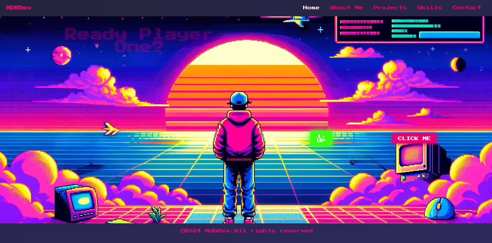
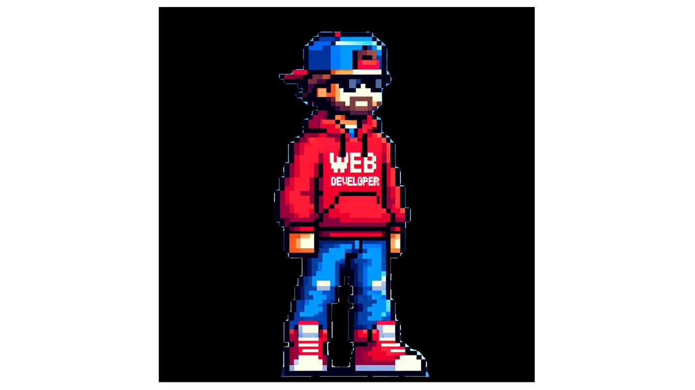

# REACTING : A Trip back to 90s pixels and video game nostalgia.

##

#

## Table of Contents
- [Description](#description)
- [Built With](#built-with)
- [Features](#features)
- [Contact](#contact)
- [License](#license)

## Description
Reacting is a front-end React project inspired by my childhood. With a 90s pixel art theme it really captures what it was like to surf the web in an era of pixelated vibrant colors and graphics. 

## Built With
**React**

## Features

**90s pixel art theme**

- ** This project has a unique theme that captures the web enviroment of the 90s. 

- **Interactice Built in CLI** This app containts a fully functioning CLI that allows users to naviagte through a driectories of skills and react tutorials.

**SPA** 

- Reacting is a SPA ( Singe Page Applicaton) this allows the users to flow through the project with pesky redirects to new browser windows. 

**** 
*User-Friendly Design:* 

 - This application has very unique and responsive UI with buttons and CTA that will prove the user to explore. 

- *Responsive Layout:* Designed with responsiveness in mind, the app ensures a consistent and enjoyable experience across different devices and screen sizes.

## Contact

- GitHub: [Maximilian93B](https://github.com/Maximilian93B)
- Email: [max.md.bosch@gmail.com](mailto:max.md.bosch@gmail.com)

## License
This project is licensed under the MIT license.

## Notes
Thanks for taking the time to view this project.

Happy Coding !!